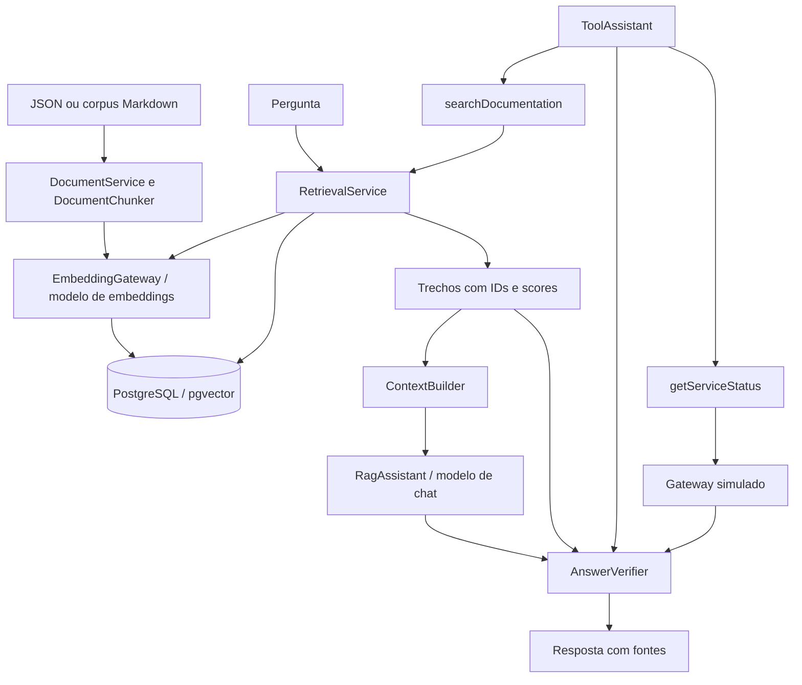
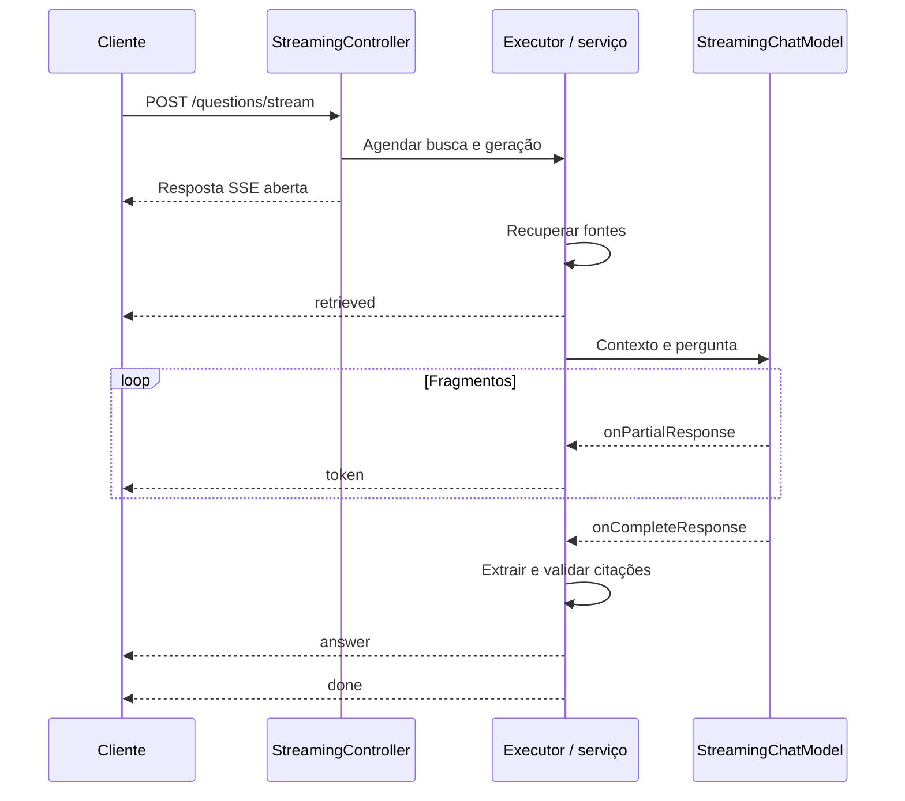

# Arquitetura do Knowledge Assistant

Aplicação Java 25 com Spring Boot Web MVC e LangChain4j. O projeto separa ingestão, recuperação, geração, validação e transporte HTTP para permitir inspecionar o contexto usado em cada resposta.

## Fluxos implementados

O preview utiliza apenas o chunker. A busca HTTP gera o embedding da consulta e retorna candidatos, sem gerar resposta. No RAG explícito, a ausência de candidatos encerra o fluxo antes do chat.

## Responsabilidades

| Componente | Responsabilidade |
| --- | --- |
| `DocumentController` | Endpoints de documento, preview e corpus |
| `DocumentChunker` | Validação, divisão, metadados e IDs determinísticos |
| `EmbeddingGateway` | Modelo de embeddings e verificação de quantidade, dimensão e valores finitos |
| `DocumentService` | Preparação dos vetores e substituição dos trechos |
| `CorpusImporter` | Leitura UTF-8 do diretório configurado |
| `PgVectorConfiguration` | Construção do store com propriedades validadas |
| `RetrievalService` | Busca por similaridade, filtro de modelo e conversão para fontes |
| `ContextBuilder` | Serialização das fontes como dados para o prompt |
| `RagQuestionService`, `RagAssistant` | Recuperação explícita e geração estruturada |
| `AnswerVerifier` | Contrato, referências de citações e classificação do resultado |
| `ToolQuestionService`, `ToolAssistant` | Ciclo modelo/tools com limites e tratamento explícito de erros |
| `KnowledgeTools` | Validação dos argumentos e captura das consultas feitas |
| `ServiceStatusGateway` | Status fictício com horário e indicação de simulação |
| `QuestionStreamingService` | RAG assíncrono, fragmentos, validação final e ciclo de vida SSE |
| `StreamingConfiguration` | Executor dedicado com virtual threads |
| `ApiExceptionHandler` | Conversão de falhas HTTP para `ProblemDetail` |

Spring Boot fornece transporte, validação, configuração e injeção. LangChain4j fornece modelos, tipos de documento, splitter, store, AI Services e execução de tools. Chat, chat em streaming e embeddings são clientes distintos.

## Configuração e execução

| Perfil Spring | Componentes |
| --- | --- |
| Nenhum | Bootstrap HTTP e Actuator, sem integrações externas |
| `knowledge` | Endpoints e fluxos; requer modelos e store |
| `ollama` | Clientes de chat, streaming e embeddings |
| `pgvector` | Propriedades do banco e `PgVectorEmbeddingStore` |

Os testes HTTP ativam `knowledge` e fornecem modelos determinísticos e store em memória. O teste de embeddings usa dimensão 3; o runtime com `nomic-embed-text:v1.5` usa 768.

O Compose principal inicia PostgreSQL 17/pgvector e Ollama, em portas de loopback 5433 e 11534, com volumes separados. `compose.app.yaml` acrescenta a aplicação compilada em Docker, na porta 8082, e monta o corpus para leitura. Dentro da rede Docker, a aplicação acessa `postgres:5432` e `ollama:11434`.

O Dockerfile compila com JDK 25 e executa com JRE 25 e usuário sem privilégios de root. O healthcheck HTTP permite verificar a inicialização da aplicação. A saúde do container Ollama não comprova a presença dos modelos; o download e a importação do corpus são operações explícitas.

## Ingestão e identidade dos trechos

Cada trecho carrega `documentId`, `title`, `embeddingModel`, `chunkId` e `chunkIndex`. O splitter pode acrescentar `index`. O UUID deriva de ID do documento, chave do modelo, posição e texto em UTF-8; o título não participa da identidade.

A divisão usa caracteres, limite 800 e sobreposição configurada 120, sem tokenizer. O preview utiliza a chave `preview`, portanto seus IDs diferem dos IDs de ingestão.

Para reindexar, o serviço prepara todos os vetores, remove registros filtrados por documento e modelo e adiciona IDs, vetores e segmentos na mesma ordem. `synchronized` serializa chamadas nessa instância. Não coordena outras instâncias nem torna a troca transacional. Uma falha de embeddings preserva os dados anteriores; uma falha após a remoção pode exigir reingestão.

A importação lê somente arquivos `.md` regulares do primeiro nível do diretório configurado, ordenados, limitados a 400.000 bytes por arquivo. O nome sem extensão define o ID e o primeiro cabeçalho `# ` define o título. O contrato é validado novamente nos objetos criados internamente. O processamento é sequencial e pode ser parcial.

## Recuperação e geração

A recuperação gera o vetor da consulta com o mesmo modelo configurado para a ingestão. O store aplica score mínimo, quantidade máxima e filtro de metadado `embeddingModel`. O resultado inclui o texto e sua origem para inspeção antes da geração.

`ContextBuilder` serializa fontes como JSON. O prompt de sistema orienta o modelo a tratar documentos como dados, ignorar instruções contidas neles e usar somente IDs disponíveis. `AiServices` cria a implementação da interface `RagAssistant`, utiliza o `ChatModel` injetado e converte a saída para `GeneratedAnswer`.

O verificador valida o DTO e rejeita citações que não pertencem aos candidatos. Com contexto suficiente, exige ao menos uma fonte citada ou um status consultado. A resposta pública contém apenas as fontes citadas. Contrato e procedência são verificados por código; a coerência semântica das afirmações ainda depende do modelo e da avaliação.

Não há memória de conversa. Cada pergunta é tratada independentemente.

## Tools e status

O fluxo de `/questions` cria um conjunto de tools por requisição, evitando compartilhar fontes e status capturados entre perguntas. O modelo recebe as descrições de `searchDocumentation` e `getServiceStatus` e pode solicitar sua execução.

Os argumentos são validados antes das operações. Erros corrigíveis têm mensagens próprias para o modelo por `ToolErrorVisibleToLlm`. Os handlers permitem informar erros de argumentos e fazem falhar a invocação quando uma exceção de execução não foi declarada visível ao modelo.

Há limite de quatro rodadas de tool calling e orçamento de oito execuções de tools. O resultado estruturado de status é serializado para o modelo, enquanto o objeto original é preservado para a resposta pública.

O gateway mantém `payment-service=DEGRADED`, `recharge-service=UP` e `auth-service=UP`. Outros nomes retornam `UNKNOWN`. Todos os resultados têm `simulated=true`. Status consultado pode sustentar uma resposta mesmo sem citações documentais.

## Streaming

O endpoint usa RAG explícito, sem tools. O executor libera a thread HTTP da busca e da geração; os callbacks recebem fragmentos e a conclusão do modelo. As escritas no emitter são serializadas por lock. Uma flag terminal impede novas emissões após encerramento.

Fragmentos não são verificados individualmente. Na conclusão, os IDs entre colchetes são extraídos e verificados contra as fontes recuperadas. Somente o evento `answer` contém o resultado final validado; falhas enviam `error` e encerram sem `done`.

Sem fontes, o serviço emite uma resposta determinística de contexto insuficiente e `done`, sem chamar o modelo. Há limite de 8.000 caracteres recebidos e timeout de 150 segundos. O cancelamento usa o handle quando disponibilizado pelo provider; não garante interrupção de toda operação externa.

## Persistência e limites

A tabela mantém chave primária UUID, vetor, texto e JSON de metadados. O builder usa `createTable(true)`, `dropTableFirst(false)` e `useIndex(false)`. O SQL inicial habilita `vector` em volumes novos.

Mudar a dimensão não migra uma tabela existente. Modelos de mesma dimensão podem gerar espaços vetoriais incompatíveis; mudanças de modelo ou estratégia de divisão exigem índice compatível e reindexação. Uma tag configurada não identifica automaticamente mudanças de pesos sob o mesmo nome.

O Actuator não inclui indicador personalizado de inferência ou persistência. O projeto não implementa autenticação, isolamento por usuário, memória de conversa, busca híbrida ou parser de PDF. O corpus e os serviços de exemplo são fictícios.

## Validação

O build padrão executa 19 testes determinísticos: contratos HTTP, busca e RAG, reingestão, citações, tools, streaming e composição de RAG com componentes da biblioteca.

O perfil `database-it` usa PostgreSQL/pgvector real separado, configurado por `src/test/resources/compose.tests.yaml`, com dados efêmeros e porta 15433. O perfil `models-it` chama chat e embeddings reais no Ollama. São executados separadamente.

`scripts/evaluate.ps1` registra resultados de um conjunto pequeno de consultas, acerto de recuperação por documento esperado, tipo de resposta e latência. O relatório permite comparar alterações, mas não mede automaticamente a fidelidade de todas as afirmações.
