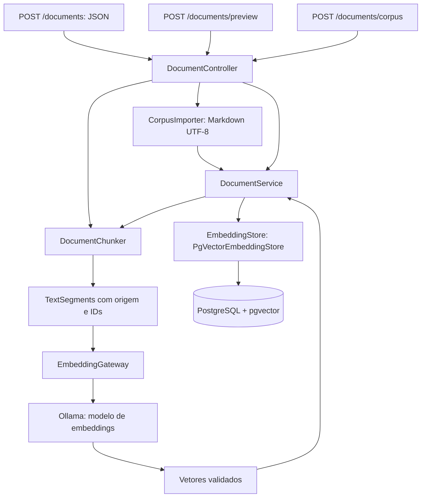

# Arquitetura do Knowledge Assistant

## Estado implementado

Uma aplicação Java 25 com Spring Boot Web MVC expõe ingestão de documentação e armazenamento vetorial por meio do LangChain4j. Ainda não há busca HTTP, geração de respostas RAG, ferramentas de status ou streaming.

O preview usa somente o chunker. O contexto Spring que expõe esse endpoint requer também as dependências dos demais métodos do controller.

## Responsabilidades

| Componente | Responsabilidade |
| --- | --- |
| `DocumentController` | Mapeamento HTTP e validação de requisições JSON |
| `DocumentRequest`, `DocumentResponse`, `ChunkView` | Entrada, recibo e inspeção |
| `DocumentChunker` | Validação comum, divisão recursiva, metadados e IDs determinísticos |
| `EmbeddingGateway` | Adaptação do modelo e verificação de quantidade, dimensão e valores finitos |
| `DocumentService` | Geração dos vetores e substituição dos trechos de um documento |
| `CorpusImporter` | Leitura do diretório configurado e reutilização da ingestão |
| `PgVectorProperties`, `PgVectorConfiguration` | Propriedades validadas e construção do store |
| `KnowledgeException`, `ApiExceptionHandler` | Falhas operacionais e respostas `ProblemDetail` |

Spring Boot oferece HTTP, injeção de dependências, validação e configuração. LangChain4j oferece tipos de documento, segmentação, modelo de embeddings e armazenamento vetorial. A integração de IA usa somente LangChain4j.

## Configuração e infraestrutura

| Perfil Spring | Componentes |
| --- | --- |
| Nenhum | Bootstrap HTTP e Actuator, sem dependências externas |
| `knowledge` | Controller e ingestão; requer modelo e store |
| `ollama` | Clientes separados de chat e embeddings |
| `pgvector` | Propriedades do banco e `PgVectorEmbeddingStore` |

O runtime de ingestão usa os três perfis. Os testes de contrato ativam somente `knowledge` e fornecem `EmbeddingModel` e `InMemoryEmbeddingStore` por configuração de teste, com dimensão 3. O runtime usa dimensão 768 por padrão.

O Compose inicia PostgreSQL 17/pgvector e Ollama em portas de loopback 5433 e 11534. Volumes separados preservam banco e modelos. O SQL inicial habilita a extensão; o builder cria a tabela com `createTable(true)`, preserva a existente com `dropTableFirst(false)` e não cria índice vetorial aproximado com `useIndex(false)`. A tabela mantém chave primária UUID, vetor, texto e JSON de metadados. Mudar a propriedade de dimensão não migra uma tabela existente.

O Actuator comprova a saúde HTTP básica. Não existe indicador personalizado de inferência ou persistência. Virtual threads estão habilitadas; chamadas atuais de modelo e store continuam síncronas.

## Identificação e substituição

Cada trecho carrega `documentId`, `title`, `embeddingModel`, `chunkId` e `chunkIndex`. O splitter pode acrescentar seu metadado `index`. O UUID deriva de ID do documento, chave do modelo, posição e texto, codificados em UTF-8. O título não participa dessa identidade.

A divisão usa caracteres, com limite 800 e sobreposição configurada 120, sem tokenizer. O preview utiliza a chave `preview`, portanto seus UUIDs diferem dos UUIDs de ingestão mesmo quando textos e posições são iguais.

Para reindexar, o serviço prepara todos os vetores, remove registros filtrados por documento **e** modelo e adiciona IDs, vetores e segmentos na mesma ordem. `synchronized` serializa chamadas nessa instância do serviço. Não coordena outras instâncias nem constitui transação PostgreSQL entre remoção e inserção. Falha de geração preserva os dados anteriores; falha de inserção após remoção pode exigir reingestão.

Alterações de modelo ou estratégia de divisão devem usar um índice compatível. Dimensão igual não implica espaço vetorial igual. A chave configurada do modelo também não identifica automaticamente mudanças nos pesos mantidas sob a mesma tag.

## Corpus e validação

A importação usa somente o diretório administrativamente configurado, sem aceitar caminho na requisição HTTP. `Files.list` examina o primeiro nível; arquivos regulares com sufixo `.md` são ordenados, limitados a 400.000 bytes e lidos em UTF-8. O nome sem extensão define o ID e o primeiro cabeçalho `# ` define o título. O chunker reaplica o contrato aos objetos criados internamente.

O processamento é sequencial e pode ser parcial. Um arquivo inválido pode interromper o lote depois de documentos anteriores já persistidos. Não há parser estrutural de Markdown. O diretório deve ser confiável, pois não há proteção adicional contra links simbólicos nem upload isolado por usuário.

## Verificação

O build padrão executa quatro testes sem infraestrutura externa: saúde HTTP real, sucesso e rejeição do contrato via MockMvc e estabilidade dos IDs no chunker. O perfil Maven `models-it` acrescenta um teste com chat e embeddings reais. Os testes atuais não verificam automaticamente importação de diretório, troca transacional, concorrência entre instâncias ou persistência PostgreSQL.
